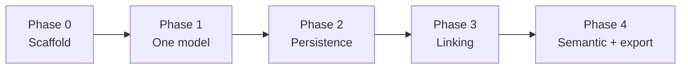

# Personal Data Modeling Tool — Requirements

2026-09-22 · @Someone

## Overview

A single-user, local-first app for drawing relational data models, saving them as plain files, linking entities across models, and defining a semantic layer on top of them.

It is built solo with Claude Code and used only by its author. Every requirement below is written so it can be checked by using the app, not by reading code.

What it must do, one line each:

- Design a model: entities, fields, keys and relationships on a drag-and-drop canvas.
- Save and reopen models from a local folder as human-readable JSON.
- Link entities and fields across models so a shared concept is defined once and reused.
- Define the semantic layer: business terms, shared dimensions and metrics that span models.
- Export a model as Postgres SQL DDL and the semantic layer as a YAML file.

This spec builds on the CTO plan already agreed: five build phases, JSON-file storage, one export dialect, behavioral acceptance tests instead of code review.

## Goals and non-goals

Success means that within about 5 weeks of part-time work the author can model a real project end to end in this tool, link it to existing models, and hand the exports to a database or to Claude Code without manual clean-up.

Goals:

1. Model a small-to-medium relational schema (up to 50 entities per model) faster than in a whiteboard tool, with the result stored as files the author owns.
2. Define each shared concept once (for example Customer) and reuse it across models, with a view of where it is used.
3. Produce a semantic layer a human or a downstream tool can read: dimensions, metrics and definitions, each traceable back to entities and fields.
4. Export Postgres DDL that runs unchanged for every feature the tool supports.
5. Remain safe to build without code review: every feature ships with a manual scenario that proves it works.

Non-goals, out of scope even when cheap to add:

- Multiple users, accounts, permissions, real-time collaboration, sharing.
- Cloud sync, hosting or any backend server; all data stays in local files.
- Talking to a live database: no reverse engineering, no migrations, no diffing against a running schema.
- More than one SQL dialect.
- Importing from other modeling tools (ERwin, dbdiagram, dbt); a possible later addition, not part of this scope.
- Running queries, profiling data, dashboards or reports.
- Themes, plugins or an extension API.

## Working context and verification

One person builds and uses this tool, writing all code through Claude Code and reviewing none of it. That shapes the requirements more than any feature does.

Rules that follow from it:

- Every functional requirement has an ID (FR-x.y) and at least one acceptance test in the Acceptance tests section. A requirement without a test is not done.
- Claude Code is asked for one requirement group at a time, in phase order, never for the whole app.
- After each group, the author runs the listed scenarios by hand in the running app. Passing scenarios, not reviewed code, is the definition of done.
- Every passing increment is committed to git before the next one starts. A broken increment is reverted, not patched forward.
- Claude Code keeps a short decision log (`DECISIONS.md`) in the repo: what it chose, why, and what it did not do. The author reads that, not the code.
- Model files are plain JSON so the author can open them in a text editor and confirm what was saved.

How to hand this spec to Claude Code: give it the Concepts, Model file format and Non-functional sections first, then one functional requirements section at a time together with its acceptance tests.

## Concepts and glossary

These words are used the same way in the UI, the file format and the code. Claude Code should name types and modules after them.

| Term | Meaning | Example |
| --- | --- | --- |
| Workspace | The local folder holding all models and the semantic layer; one open at a time | `~/models/quest/` |
| Model | A named set of entities and relationships for one domain; one JSON file each | `orders.model.json` |
| Entity | A table-like object made of fields | `Order`, `Customer` |
| Field | A column of an entity: name, data type, nullable, key flags, default, description | `Order.placed_at` |
| Data type | One of a fixed set the tool knows, mapped to a Postgres type on export | `timestamp`, `decimal(12,2)` |
| Relationship | A directed connection between two entities in the same model, with cardinality and the foreign-key field | `Order` many-to-one `Customer` via `customer_id` |
| Link | A cross-model statement that an entity or field is the same as, or refers to, one in another model | `crm.Customer` same-as `orders.Customer` |
| Semantic layer | Workspace-level business meaning defined over entities and fields from any model | one `semantic.json` per workspace |
| Term | A business word with a definition, bound to the entities or fields that carry it | Active customer: placed an order in the last 90 days |
| Dimension | A shared attribute used to slice metrics, backed by an entity or field | Customer, Order date, Region |
| Metric | A named measure with an expression over fields, a grain and optional filters | Revenue = sum of `OrderLine.amount` |
| Lineage | The set of models, entities and fields a term, dimension or metric depends on | Revenue depends on `orders.OrderLine.amount` |

## Functional requirements — modeling and canvas

This group is Phase 1 of the plan: one model, fully editable on a canvas, before any saving, linking or export exists. Requirement IDs are stable; the acceptance tests refer to them.

### FR-1 Workspace and models

| ID | Requirement |
| --- | --- |
| FR-1.1 | Open a workspace folder; the app lists every model in it and remembers the last workspace on restart |
| FR-1.2 | Create, rename, duplicate and delete a model; a model has a name, a description and created/updated timestamps |
| FR-1.3 | Several models can be open in tabs; exactly one is active on the canvas at a time |
| FR-1.4 | Model names are unique within a workspace; the file name is derived from the model name |

### FR-2 Entities and fields

| ID | Requirement |
| --- | --- |
| FR-2.1 | Create, rename and delete entities; an entity has a name, an optional description and optional tags |
| FR-2.2 | Add, edit, reorder and delete fields; a field has name, data type, nullable flag, primary-key flag, unique flag, optional default value and optional description |
| FR-2.3 | Data types are a fixed set: `string(n)`, `text`, `integer`, `bigint`, `decimal(p,s)`, `boolean`, `date`, `timestamp`, `uuid`, `json`. No free-text types |
| FR-2.4 | Composite primary keys: more than one field can carry the primary-key flag |
| FR-2.5 | Entity names are unique within a model and field names within an entity; a duplicate shows an inline error but never blocks saving |
| FR-2.6 | Names must be valid unquoted Postgres identifiers: letters, digits and underscore, not starting with a digit, at most 63 characters |
| FR-2.7 | Deleting an entity removes its relationships and warns when other models link to it (see FR-6) |

### FR-3 Relationships

| ID | Requirement |
| --- | --- |
| FR-3.1 | Create a relationship by dragging from one entity to another on the canvas, or from a form in the side panel |
| FR-3.2 | Cardinality is one of one-to-one, one-to-many, many-to-many; each end can be marked optional or mandatory |
| FR-3.3 | For one-to-many and one-to-one, the relationship names the foreign-key field on the child entity; the tool offers to create that field with the referenced primary key's type |
| FR-3.4 | For many-to-many, the tool creates a junction entity with both foreign keys, or lets the author pick an existing one |
| FR-3.5 | A relationship has an optional label (a verb phrase such as *places*) and a description |
| FR-3.6 | Self-referencing relationships are allowed (for example `Employee.manager_id`) |
| FR-3.7 | Changing the referenced primary key's type updates the foreign-key field's type, with a visible notice |

### FR-4 Canvas

| ID | Requirement |
| --- | --- |
| FR-4.1 | Entities render as cards showing name and fields with key markers and types; relationships render as lines with crow's-foot cardinality markers |
| FR-4.2 | Drag to move entities; pan, zoom and fit-to-view; positions are saved with the model |
| FR-4.3 | Selecting an entity or relationship opens it in a side panel for editing; double-click renames inline |
| FR-4.4 | Search box jumps to an entity by name and highlights it |
| FR-4.5 | Undo and redo cover every model edit, at least 50 steps deep |
| FR-4.6 | Keyboard: Delete removes the selection after a confirmation; Ctrl/Cmd+S saves; Ctrl/Cmd+Z and Ctrl/Cmd+Shift+Z undo and redo |
| FR-4.7 | An *arrange* action lays out all entities automatically without changing the model itself |
| FR-4.8 | The canvas stays smooth with 50 entities and 100 relationships (see NFR-3) |

## Functional requirements — persistence

This group is Phase 2: everything on disk is plain JSON the author can open in a text editor and commit to git. No database, no server, no network.

### FR-5 Files and saving

| ID | Requirement |
| --- | --- |
| FR-5.1 | A workspace is a folder containing `workspace.json`, one `<model-name>.model.json` per model, `links.json` for cross-model links and `semantic.json` for the semantic layer |
| FR-5.2 | Every entity, field, relationship, link, term, dimension and metric has a stable random ID; names are display values and can change without breaking references |
| FR-5.3 | Saving writes to a temporary file and renames it into place, so a crash never leaves a half-written file |
| FR-5.4 | Autosave 2 seconds after the last change, plus explicit save with Ctrl/Cmd+S; a tab shows an unsaved marker until the write completes |
| FR-5.5 | Files are pretty-printed with 2-space indent, keys in a fixed order and arrays in a stable order, so git diffs show only what changed |
| FR-5.6 | Every file carries a `formatVersion`; the app migrates older versions on open and refuses newer ones with a clear message |
| FR-5.7 | A file that fails validation on open shows the file path and the reason, and is never overwritten |
| FR-5.8 | If a file changes on disk while open (text editor, git checkout), the app notices and offers *reload* or *keep mine* |
| FR-5.9 | The last 20 saved versions of each file are kept under `.history/` in the workspace, and any one can be restored from the app |
| FR-5.10 | Opening a workspace with 20 models and 500 entities in total takes under 2 seconds |

## Functional requirements — cross-model linking

This group is Phase 3 and the first place real design judgment shows up. A link never copies or moves anything; it records that two things in different models are related, and everything else (badges, validation, the semantic layer) reads from that record.

Three link types cover the cases the author needs:

| Type | From | To | Meaning |
| --- | --- | --- | --- |
| same-as | entity | entity | Both represent the same real-world thing; carries a mapping of corresponding fields |
| references | field | entity | The field is a foreign key to an entity in another model |
| derived-from | field | field | The field is computed from the other one; lineage only, no constraint |

Entities joined by same-as links form a **concept group**. The author picks one entity as canonical and names the group (for example *Customer*). The semantic layer binds dimensions to concept groups, so a shared concept is defined once.

### FR-6 Links

| ID | Requirement |
| --- | --- |
| FR-6.1 | Create a link of any of the three types from an entity's or field's side panel, choosing the target model, entity and field from dropdowns |
| FR-6.2 | For a same-as link the tool proposes field mappings by matching names and types; the author confirms, edits or clears each pair |
| FR-6.3 | A workspace map shows every model as a group and every link as a line between groups, with a count per pair of models; clicking a line lists its links |
| FR-6.4 | An entity or field with links shows a badge on the canvas; hovering lists the linked items with their model names |
| FR-6.5 | Links live in `links.json` and refer to items by ID, so renaming anything anywhere never breaks a link |
| FR-6.6 | Deleting a linked entity or field warns, lists the affected links and, on confirm, deletes those links too; no dangling links can exist after save |
| FR-6.7 | A same-as group has one canonical entity and a name; same-as links are transitive, so A–B and B–C put A, B and C in one group |
| FR-6.8 | *Where used* on any entity or field lists every link, dimension and metric that depends on it, across all models |
| FR-6.9 | Validation flags mapped fields with different data types, a references link to an entity without a primary key, and a same-as group with no canonical entity |
| FR-6.10 | *Sync from canonical* copies fields that exist on the canonical entity but not on the selected one; always explicit, never automatic |

## Functional requirements — semantic layer

This group is Phase 4. The semantic layer is one workspace-level file that gives business meaning to entities and fields from any model. It has three object types: terms, dimensions and metrics. Each binds to concept groups, entities or fields by ID, so it stays valid through renames.

Metric expressions are deliberately simple: one aggregate over one field, with optional filters on fields of the same entity or of dimensions joined to it. That is enough for a personal semantic layer and keeps the expression parser small. Arbitrary SQL in expressions is out of scope.

### FR-7 Terms, dimensions and metrics

| ID | Requirement |
| --- | --- |
| FR-7.1 | A term has a name, a definition, optional synonyms and zero or more bindings to concept groups, entities or fields |
| FR-7.2 | A dimension has a name, a description, a binding to a concept group (or a single entity when nothing is linked) and a list of attributes, each bound to a field |
| FR-7.3 | A time dimension is a dimension bound to a `date` or `timestamp` field, with grains day, week, month, quarter, year |
| FR-7.4 | A metric has a name, a description, an aggregate (`sum`, `count`, `count_distinct`, `avg`, `min`, `max`), the field it aggregates, its grain entity and optional filters |
| FR-7.5 | A filter is field, operator (`=`, `!=`, `<`, `<=`, `>`, `>=`, `in`, `is null`, `is not null`) and a value; filters combine with AND only |
| FR-7.6 | A derived metric combines up to two existing metrics with `+`, `-`, `*` or `/` (for example conversion rate = orders / sessions) |
| FR-7.7 | The semantic view lists all three object types with search, and a detail panel for editing; no canvas is needed here |
| FR-7.8 | Lineage for any term, dimension or metric shows the models, entities and fields it depends on, as a small tree, and links back to them on the canvas |
| FR-7.9 | Validation flags a metric whose aggregate does not fit its field's type (for example `sum` over `text`), a binding to a deleted item, and two objects with the same name |
| FR-7.10 | Deleting a bound field or entity warns and lists the semantic objects that depend on it, the same way as FR-6.6 |
| FR-7.11 | Names of terms, dimensions and metrics are unique within the workspace and may contain spaces; an identifier-safe `key` is derived automatically for export |

## Functional requirements — export and validation

Export targets one dialect, Postgres 16, and one semantic format, YAML. Output is deterministic so exported files can be committed and diffed like the model files.

### FR-8 DDL export

| ID | Requirement |
| --- | --- |
| FR-8.1 | Export a model as one `.sql` file: a `CREATE TABLE` per entity with columns in field order, `NOT NULL`, `DEFAULT`, `PRIMARY KEY` and `UNIQUE` constraints, and a `FOREIGN KEY` per relationship |
| FR-8.2 | Many-to-many relationships export their junction entity like any other table, with both foreign keys and a composite primary key |
| FR-8.3 | Tables are ordered so every referenced table is created before the table that references it; circular references emit their foreign keys as `ALTER TABLE` statements at the end |
| FR-8.4 | Entity and field descriptions export as `COMMENT ON TABLE` and `COMMENT ON COLUMN` statements |
| FR-8.5 | Whole-workspace export writes one file with a `CREATE SCHEMA` per model, tables inside their model's schema, and cross-model *references* links as foreign keys at the end |
| FR-8.6 | The same model always produces a byte-identical file |
| FR-8.7 | Export runs validation first; errors block the export with a list, warnings do not |

Type mapping, the only one the tool knows:

| Tool type | Postgres type |
| --- | --- |
| `string(n)` | `varchar(n)` |
| `text` | `text` |
| `integer` | `integer` |
| `bigint` | `bigint` |
| `decimal(p,s)` | `numeric(p,s)` |
| `boolean` | `boolean` |
| `date` | `date` |
| `timestamp` | `timestamp with time zone` |
| `uuid` | `uuid` |
| `json` | `jsonb` |

### FR-9 Semantic export

| ID | Requirement |
| --- | --- |
| FR-9.1 | Export the semantic layer as `semantic.yaml` with sections `terms`, `dimensions` and `metrics`; every binding is written as a readable `model.entity.field` path, never an ID |
| FR-9.2 | Each metric carries a generated SQL snippet (`SELECT <aggregate> FROM <grain table> WHERE <filters>`) so it can be checked by eye or pasted into a query |
| FR-9.3 | Output is deterministic and ordered by name |

### FR-10 Validation

| ID | Requirement |
| --- | --- |
| FR-10.1 | A validation panel lists every issue in the workspace with severity, message and a *go to* action that selects the offending item |
| FR-10.2 | Errors: duplicate names, invalid identifiers, foreign key whose type differs from the referenced key, dangling references, aggregate that does not fit the field type |
| FR-10.3 | Warnings: entity without a primary key, entity with no relationships, canonical entity with undocumented fields, dimension or term nothing uses |
| FR-10.4 | Validation reruns after every change (debounced) and never blocks saving; only export checks it |
| FR-10.5 | All rules live in one module with one function per rule, so a rule can be added or switched off without touching the rest |

## Non-functional requirements

The tool is a desktop app that owns nothing but a folder of files. Everything below exists to keep it simple enough for one person to trust without reading its code.

| ID | Requirement |
| --- | --- |
| NFR-1 | Local-first and offline: no network calls at all, no telemetry, no accounts; unplugging the network changes nothing |
| NFR-2 | Runs as a desktop app on the author's machine (Tauri or Electron wrapping a React app); the exact framework is Claude Code's call, recorded in `DECISIONS.md` |
| NFR-3 | Performance: canvas interactions render within 16 ms at 50 entities and 100 relationships; a model with 200 entities still opens and saves, just without auto-layout guarantees |
| NFR-4 | Startup to an open workspace in under 3 seconds on a laptop |
| NFR-5 | Every file the app writes is readable and editable in a text editor and diffable in git (FR-5.5) |
| NFR-6 | No data loss: atomic writes (FR-5.3), history (FR-5.9) and undo (FR-4.5) together mean no single action or crash loses more than the last 2 seconds of edits |
| NFR-7 | Errors are shown in plain language with the item or file involved; the app never fails silently and never shows a stack trace as the only message |
| NFR-8 | Dependencies: one diagramming library (React Flow or equivalent), one state library, one YAML library; anything else needs a line in `DECISIONS.md` explaining why |
| NFR-9 | Tests: unit tests exist for the file format, type mapping, DDL export and validation rules; Claude Code writes them, the author only runs `npm test` and expects green |
| NFR-10 | The codebase stays small enough to rebuild: under 15,000 lines of application code at the end of Phase 4 |

## Model file format

Three file shapes cover the whole workspace: a model file, `links.json` and `semantic.json`. Claude Code should implement these as typed schemas (for example with Zod) and validate every file on open; the examples below are the contract.

Conventions that apply to all three:

- IDs are a type prefix plus 8 random characters: `e_` entity, `f_` field, `r_` relationship, `l_` link, `c_` concept group, `t_` term, `d_` dimension, `k_` metric, `m_` model.
- Any reference into another file carries the model ID as well as the item ID.
- `default` is a raw SQL expression stored as a string and exported verbatim.
- Optional keys are omitted when empty rather than written as `null` or `[]`.

A model file, `orders.model.json`:

```json
{
  "formatVersion": 1,
  "id": "m_7h3k9q2z",
  "name": "orders",
  "description": "Order capture and fulfilment",
  "createdAt": "2026-09-22T10:00:00Z",
  "updatedAt": "2026-09-22T10:42:00Z",
  "entities": [
    {
      "id": "e_a1b2c3d4",
      "name": "Order",
      "description": "One customer purchase",
      "tags": ["core"],
      "position": { "x": 120, "y": 80 },
      "fields": [
        { "id": "f_x9y8z7w6", "name": "id", "type": "uuid", "nullable": false, "primaryKey": true, "default": "gen_random_uuid()" },
        { "id": "f_q1w2e3r4", "name": "customer_id", "type": "uuid", "nullable": false },
        { "id": "f_t5y6u7i8", "name": "placed_at", "type": "timestamp", "nullable": false },
        { "id": "f_o9p0a1s2", "name": "total", "type": "decimal", "precision": 12, "scale": 2, "nullable": false, "description": "Sum of lines incl. tax" }
      ]
    }
  ],
  "relationships": [
    {
      "id": "r_d3f4g5h6",
      "label": "places",
      "cardinality": "one-to-many",
      "parentEntity": "e_c9v8b7n6",
      "childEntity": "e_a1b2c3d4",
      "parentOptional": false,
      "childOptional": true,
      "foreignKeyFields": ["f_q1w2e3r4"]
    }
  ]
}
```

`parentEntity` is the side that holds the primary key, `childEntity` the side that holds the foreign key. A many-to-many relationship adds `"junctionEntity": "e_…"` and leaves `foreignKeyFields` empty, because the junction entity's own fields carry both keys. `string` fields carry `length`; `decimal` fields carry `precision` and `scale`.

`links.json` holds every cross-model link and the concept groups they form:

```json
{
  "formatVersion": 1,
  "links": [
    { "id": "l_j7k8l9m0", "type": "same-as",
      "from": { "model": "m_crm00001", "entity": "e_cust0001" },
      "to": { "model": "m_7h3k9q2z", "entity": "e_c9v8b7n6" },
      "fieldMappings": [ { "from": "f_email001", "to": "f_email002" } ] },
    { "id": "l_n1b2v3c4", "type": "references",
      "from": { "model": "m_7h3k9q2z", "entity": "e_a1b2c3d4", "field": "f_q1w2e3r4" },
      "to": { "model": "m_crm00001", "entity": "e_cust0001" } }
  ],
  "conceptGroups": [
    { "id": "c_z1x2c3v4", "name": "Customer", "canonical": { "model": "m_crm00001", "entity": "e_cust0001" } }
  ]
}
```

`semantic.json` holds terms, dimensions and metrics; a metric example shows the whole expression shape:

```json
{
  "formatVersion": 1,
  "terms": [
    { "id": "t_a9s8d7f6", "name": "Active customer", "definition": "Placed at least one order in the last 90 days",
      "bindings": [ { "concept": "c_z1x2c3v4" } ] }
  ],
  "dimensions": [
    { "id": "d_g5h4j3k2", "name": "Customer", "concept": "c_z1x2c3v4",
      "attributes": [ { "name": "Region", "field": { "model": "m_crm00001", "entity": "e_cust0001", "field": "f_region01" } } ] },
    { "id": "d_l1p2o3i4", "name": "Order date", "time": true,
      "field": { "model": "m_7h3k9q2z", "entity": "e_a1b2c3d4", "field": "f_t5y6u7i8" } }
  ],
  "metrics": [
    { "id": "k_u8y7t6r5", "name": "Revenue", "key": "revenue", "aggregate": "sum",
      "field": { "model": "m_7h3k9q2z", "entity": "e_a1b2c3d4", "field": "f_o9p0a1s2" },
      "grain": { "model": "m_7h3k9q2z", "entity": "e_a1b2c3d4" },
      "filters": [ { "field": { "model": "m_7h3k9q2z", "entity": "e_a1b2c3d4", "field": "f_status01" }, "op": "=", "value": "paid" } ] },
    { "id": "k_e4w3q2a1", "name": "Average order value", "key": "average_order_value",
      "derived": { "left": "k_u8y7t6r5", "op": "/", "right": "k_orders001" } }
  ]
}
```

## Acceptance tests

Run these by hand in the app after each phase. A phase is done when every scenario in its group passes; a failing scenario goes back to Claude Code with the scenario ID and what happened instead. The same two sample models are used throughout: **crm** (Customer, Address) and **orders** (Customer, Order, OrderLine, Product).

### Phase 1 — modeling and canvas

| ID | Scenario | Expected |
| --- | --- | --- |
| AT-1.1 | Create model *orders*; add entity `Order` with fields `id` (uuid, PK), `placed_at` (timestamp), `total` (decimal 12,2) | Card shows three fields, key marker on `id`, types visible |
| AT-1.2 | Rename `Order` to `Order` again with a trailing space, then to `1order` | Both rejected inline with a message; the name is unchanged |
| AT-1.3 | Add `Customer` with `id` uuid PK; drag from `Customer` to `Order`, pick one-to-many, accept the offered `customer_id` field | `customer_id` appears on `Order` as uuid, line drawn with crow's foot on the `Order` end |
| AT-1.4 | Add `Product`; drag `Order` to `Product`, pick many-to-many, accept the junction | `OrderProduct` entity appears with `order_id` and `product_id`, both keys, two lines drawn |
| AT-1.5 | Move three cards, zoom out, press fit-to-view | Positions kept, all cards visible |
| AT-1.6 | Delete `Product`, then undo, then redo | Entity and its lines vanish, return, vanish again |
| AT-1.7 | Change `Customer.id` type to `bigint` | `Order.customer_id` and `OrderProduct` keys become `bigint`, with a notice listing them |
| AT-1.8 | Type `Cust` in search | `Customer` is selected and centred |

### Phase 2 — persistence

| ID | Scenario | Expected |
| --- | --- | --- |
| AT-2.1 | Build AT-1.1 to AT-1.4, wait 3 seconds, quit, reopen | Model reopens identical, positions included |
| AT-2.2 | Open `orders.model.json` in a text editor | Readable JSON matching the file-format section, `formatVersion` present, every item has an ID |
| AT-2.3 | Rename `Order` to `SalesOrder`, save, run `git diff` on the workspace | Only the name line changes |
| AT-2.4 | Edit `total` scale from 2 to 3 in the text editor while the app is open | App offers reload; reload shows scale 3 |
| AT-2.5 | Break the JSON in the editor (delete a bracket), reopen the workspace | Error names the file and the problem; the file is not modified; other models still open |
| AT-2.6 | Save five times with a change each, open history, restore version 2 | Model matches what it was after the second save |

### Phase 3 — cross-model linking

| ID | Scenario | Expected |
| --- | --- | --- |
| AT-3.1 | Create model *crm* with `Customer` (`id` uuid PK, `email` string 255, `region` string 50); create a same-as link from `crm.Customer` to `orders.Customer` | Tool proposes `id`↔`id`; author adds `email`↔`email_address`; both cards show a link badge |
| AT-3.2 | Name the concept group *Customer* with `crm.Customer` canonical | Workspace map shows crm and orders with one line labelled 1 |
| AT-3.3 | Create a references link from `orders.Order.customer_id` to `crm.Customer` | Map count becomes 2; *where used* on `crm.Customer` lists both links |
| AT-3.4 | Rename `crm.Customer` to `Client`; reopen the workspace | Links intact, badge text shows the new name |
| AT-3.5 | Change `crm.Client.email` to `text` while it is mapped to a `string(255)` field | Validation panel shows a type-mismatch error; *go to* selects the field |
| AT-3.6 | Delete `orders.Customer` | Warning lists the same-as link; on confirm, the link is gone from `links.json` and the map shows count 1 |
| AT-3.7 | Run *sync from canonical* on a fresh entity linked same-as to `crm.Client` | `email` and `region` are added; nothing changes without clicking |

### Phase 4 — semantic layer and export

| ID | Scenario | Expected |
| --- | --- | --- |
| AT-4.1 | Create dimension *Customer* on the Customer concept group with attribute *Region* bound to `crm.Client.region` | Lineage shows crm → Client → region |
| AT-4.2 | Create time dimension *Order date* on `orders.Order.placed_at` | Grains day to year listed |
| AT-4.3 | Create metric *Revenue* = sum of `orders.OrderLine.amount`, grain `OrderLine`, filter `Order.status = paid` | Detail panel shows the generated SQL snippet with the filter |
| AT-4.4 | Create metric *Line count* = count of `OrderLine.id`, then derived metric *Average line value* = Revenue / Line count | Derived metric lists both parents in lineage |
| AT-4.5 | Change the aggregate of *Revenue* to `sum` over `Order.status` (text) | Validation error; export button disabled with the error shown |
| AT-4.6 | Export *orders* to DDL, run the file against a fresh Postgres 16 database (`docker run postgres:16`, then `psql -f orders.sql`) | No errors; `\dt` lists Order, OrderLine, Product, OrderProduct, Customer with the expected keys and comments |
| AT-4.7 | Export the workspace | One file with schemas `crm` and `orders`, cross-model foreign key at the end, runs cleanly in the same way |
| AT-4.8 | Export twice without changes, compare the files | Byte-identical |
| AT-4.9 | Export `semantic.yaml` | Paths read `orders.OrderLine.amount`, no IDs anywhere, Revenue carries its SQL snippet |

AT-4.6 and AT-4.7 are the only steps that touch a real database, and only for verification. Claude Code should provide a one-line script for them so the author never has to write `psql` commands.

## Priority and phasing

Build in the five phases from the plan, each ending in a working app and a passing acceptance group. About 20 to 30 part-time days in total; the earlier 3 to 5 week estimate did not size export and validation.



Each arrow is a git commit made only after the phase's acceptance tests pass.

| Phase | Requirements | Exit test | Effort (part-time days) |
| --- | --- | --- | --- |
| 0 Scaffold | Repo, app shell, empty canvas, test runner, `DECISIONS.md` | App opens to an empty canvas; `npm test` runs green | 1–2 |
| 1 One model | FR-2, FR-3, FR-4; models held in memory only | AT-1.1 to AT-1.8 | 5–8 |
| 2 Persistence | FR-1, FR-5 | AT-2.1 to AT-2.6 | 2–3 |
| 3 Linking | FR-6, FR-10 (validation panel first appears here) | AT-3.1 to AT-3.7 | 5–7 |
| 4 Semantic and export | FR-7, FR-8, FR-9 | AT-4.1 to AT-4.9 | 7–10 |

Priority within each phase:

- Must (the tool is not usable without them): FR-1, FR-2, FR-3.1–3.4, FR-4.1–4.6, FR-5.1–5.7, FR-6.1–6.7, FR-7.1–7.5, FR-7.7, FR-7.9, FR-7.11, FR-8.1–8.4, FR-8.6–8.7, FR-10.1–10.4.
- Should (built in the same phase when the Must items land on time, otherwise the next one): FR-3.5–3.7, FR-4.7–4.8, FR-5.8–5.10, FR-6.8–6.10, FR-7.6, FR-7.8, FR-7.10, FR-8.5, FR-9, FR-10.5.
- Could (only after Phase 4, only if still wanted): import from DDL or dbdiagram, a second SQL dialect, PNG or SVG export of the canvas, dark mode.

Rule for scope pressure: drop a Should before slipping a phase, and never start the next phase with a failing Must.

## Assumptions, open decisions and risks

Five assumptions were made to keep this spec complete; each is cheap to change now and expensive after Phase 3.

1. Export dialect is Postgres 16. The plan left it open and recommended Postgres as the default; if the models will run on MySQL, Snowflake or SQLite instead, the FR-8 type mapping changes before Phase 4.
2. The app is a desktop app (Tauri or Electron) rather than a browser tab, because it must read, write and watch a folder.
3. Semantic export is YAML shaped loosely like dbt or Cube metric definitions, without matching either exactly.
4. One workspace is one folder; git on that folder is the author's choice and not something the app manages.
5. The *crm* and *orders* sample models are invented for testing; real models replace them from Phase 2 on.

Open decisions, needed from the author before the phase named:

- [ ] Which database will these models actually be deployed on? (FR-8, before Phase 4)
- [ ] Which operating systems must it run on? (NFR-2, before Phase 0)
- [ ] Does `semantic.yaml` need to match a specific consumer such as dbt, Cube or LookML? If yes, FR-9 becomes a Must with that format. (before Phase 4)
- [ ] Should a many-to-many relationship always create a junction entity, or may a bare N:M line exist in conceptual models? (FR-3.4, before Phase 1)
- [ ] Is the *derived-from* link type needed in the first version, or can FR-6 ship with same-as and references only? (before Phase 3)

| Risk | Effect if it happens | Mitigation |
| --- | --- | --- |
| The semantic layer design proves wrong on real models | Phase 4 rework, the most expensive phase | Build Phase 4 against real models, keep the expression grammar tiny, budget one redesign |
| Canvas library limits (edge routing, 50-entity performance) | Diagrams look poor or lag | Choose the library in Phase 0 and load a 50-entity model in Phase 1 before building more on it |
| Bugs in file handling go unnoticed with no code review | Corrupted or lost models | Atomic writes, history, unit tests on the file format, text-editor checks in AT-2 |
| Scope creep (second dialect, import, collaboration) | Phases slip and nothing finishes | Non-goals list, Could bucket, drop-a-Should-before-slipping rule |
| Claude Code drifts from the spec across sessions | Inconsistent names and structure | Hand it the glossary and file format at the start of every session; it appends to `DECISIONS.md` |
| File format changes between phases break earlier files | Old models will not open | `formatVersion` with migrations (FR-5.6) and a sample workspace kept as a test fixture |
